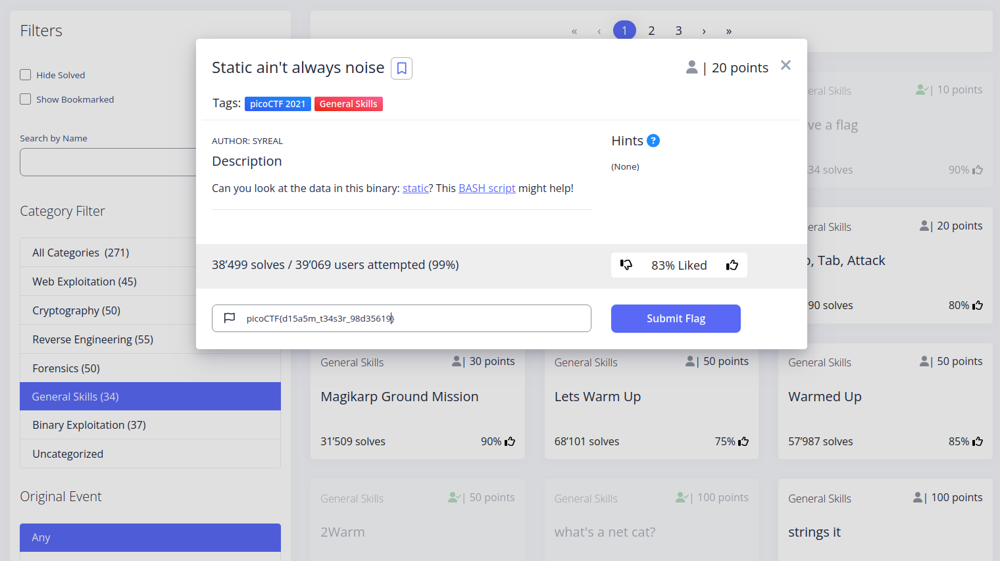

# Static ain't always noise
This challenge was pretty simple, the players were given a bash script, which was hinting at the use of objdump to display defined text.  
By just running strings on the file, the flag was there:D


`strings static`
in terminal 

```
]A\A]A^A_
Oh hai! Wait what? A flag? Yes, it's around here somewhere!
;*3$"
picoCTF{d15a5m_t34s3r_98d35619}
GCC: (Ubuntu 7.5.0-3ubuntu1~18.04) 7.5.0
crtstuff.c
```


